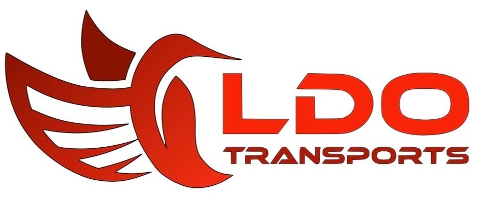

 

#### La solution web du transporteur LDO Transports (Toulouse)

<u>**

Description
**</u>

Ce projet est une demande client (des anciens collègues qui ont monté une entreprise de Transport Routier de Marchandise).

Depuis la dernière fois j'ai fait un point sur le besoin final du client pour les premières version, ce qui a modifier certaines features du site.

L'idée dans un premier temps est d'avoir :

   <u>**

Une home page
**</u>  
   Elle présentera l'activité de l'entreprise (le contenu nous sera donner par le client), pour le moment cette partie sera en brut texte + images.  
   Pour une version futur on pourrait imaginer que le client puisse saisir lui même le contenue via des articles sur le site.
   

   <u>**

Une page recrutement
**</u>   
   La gestion du recrutement de l'entreprise passera via notre solution !

   * L'idée est d'avoir une solution propre et avec une visibilité / expérience utilisateur à la hauteur.  
   Dans sa précédente entreprise de transport, la partie recrutement été un peu fouilli car toutes les offres apparaissaient les unes en-dessous des autres.  
   * Il voudrait une carte de france découpé en région et lorsque le chauffeur clique sur le morceau de région, celle-ci apparait avec les postes de la région à pourvoir (il m'a dit un truc "stylé" lors de l'apparition des postes genre comme si les postes sortaient du morceaux de région ^.^) : attention il ne faudra pas trop de détail sur la carte, car le client souhaite masquer les lieux de prise de poste aux concurrents.   
   
   Visible par le visiteur :  
   * Le visiteur pourra voir les recrutements
   * Le visiteur pourra répondre à des offres via un formulaire (nom, prénom, message, adresse mail, cv.pdf)

   Visible par l'admin(ldo) - Backoffice :
   * Gestion des offres d'emplois (CRUD)
   * Template type pour créer une offre
   * Gestion des cv en permettant de répondre au cv par un mail type en cliquant sur un bouton "refuser" (le visiteur reçois un mail de refus type) ou "accepté" (le visiteur est embaucher, le mail indiquera les modalités du processus de recrutement).  
   Il faudrait une solution pour que la rh reçoive le cv en pdf du chauffeur pour créer l'embauche via un bouton qui permettrais de transférer le cv ou en cliquant sur "accepté" ?  
   * Gestion de la RGPD sur la partie information et donnée recueillis : <u>C'est très important pour le client</u>  
Pouvoir en un clique récupérer les infos que le site détiens sur le visiteur qui a postulé (les infos du formulaire de recrutement)  
Pouvoir supprimer les infos en question  
   * Créer une partie archivage des cv intéressants (non embaucher mais pourrais faire l'affaire plustard) sur le backofficee
   * Au niveau de la place en bdd, c'est au client de se faire le ménage s'il veut pas avoir un site trop lourd ou qui coûte cher, cela évitera de perdre des infos importante et d'avoir une autonomie sur la solution

   <u>**

Un intranet(si on a le temps :))
**</u> 
   On pourrait même créer l'intranet d'une société ? Pouah ! Mais pas si vite, nous allons avoir beaucoup de travail sur la partie recrutement :)  
   Si nous sommes en avance ou après l'apothéose, l'idée est de faire un intranet pour la société LDO afin de pouvoir lister les salariés de l'entreprise et cliquer sur un salarié pour avoir ses informations (photo, nom, prénom, tél, permis à jours, date de renouvellement du permis pro ect). Mais pas que ! 

   * Communication avec le salarié (documents de sécurité surtout car la partie légal contrat ect est fait avec docu signe)
   * Pouvoir gérer les congés (demande, accepation ect)
   * Backoffice : création d'un utilisateur côté admin avec mdp et id et pourquoi pas envoyer les infos par mail au salarié ?
   * Backoffice : connexion du salarié dans un espace qui lui est réservé avec une partie "boîte de reception" ou "message" et ses infos perso, avec la possibilité d'ajouter des documents

Si nous avons des questions, le client est à notre disposition, mais l'idée c'est de regrouper un max les question pour ne pas l'appeler toutes les 5 minutes :D
  

---

## Stack technique (à faire évoluer ensemble, c'est des idées)

<u>**

Gestion de projet
**</u>
- Github "Projects" pour gérer les cards des sprints ect
- Git pour la partie versionning et collaboration
- Architecture MVC
- Méthode AGILE

<u>**

Stack Front-end
**</u>
- React
- Sass
- Pour la suite à voir avec le Lead Dev Front

<u>**

Stack Back-end
**</u>

**Base de donnée** :
- SGBD : Postgresql / SQL
- Utilisation de contraintes et domaines avec des RegEx pour contrôler et valider les données
- Utilisation de fonctions SQL pour les routes post/patch/put
- Respect de la 3FN
- Utilisation d'index en fonction du besoin : B-tree / Brin

**Migration et versionning de BDD** :
- Sqitch
- Scripts (au besoin)

**Confection API** :
- Modeles Active Record 
    - Chaque table aura son modéle avec ses methodes static (findOne, findAll, ect)
- Nodejs
- Framework Express
- Gestion du cache avec Redis
- Module PG
- Module Multer (à voir en fonction du besoin du front)
- Module sanityzer ? à voir
- Modules session ? cookie-parser ? - à voir

<u>**

Sécurité et validation de données
**</u>
- JWT(JSON Web Token) générer un token à l'authentification d'un utilisateur (à voir sont utilisation)
- bcrypt pour hacher les mdp ? (à voir en fonction du besoin)
- Joi pour la validation et la description de schémas d'objets côté back
- [Yup](https://github.com/jquense/yup) pour la validation et la description de schémas d'objets côté front si besoin ?

<u>**

Documentation
**</u>

- Swagger pour la parties routes
- JsDoc

